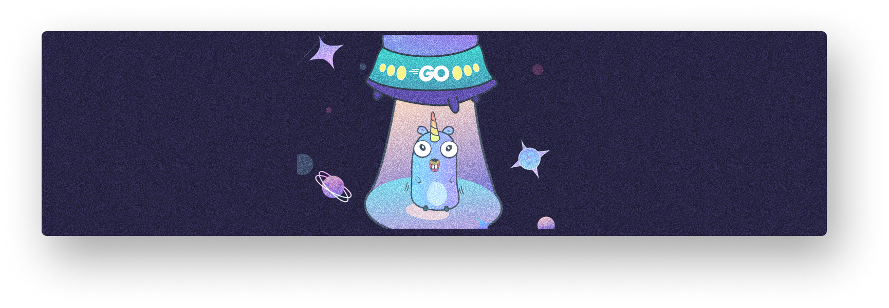

# Go Interview

## [Basic](https://github.com/vladjong/GoInterview/tree/main/Go "Decorator")

## [OOP](https://github.com/vladjong/GoInterview/tree/main/OOP "Decorator")

## [Multithreading](https://github.com/vladjong/GoInterview/tree/main/Multithreading "Decorator")

## [Network](https://github.com/vladjong/GoInterview/tree/main/Network "Decorator")
