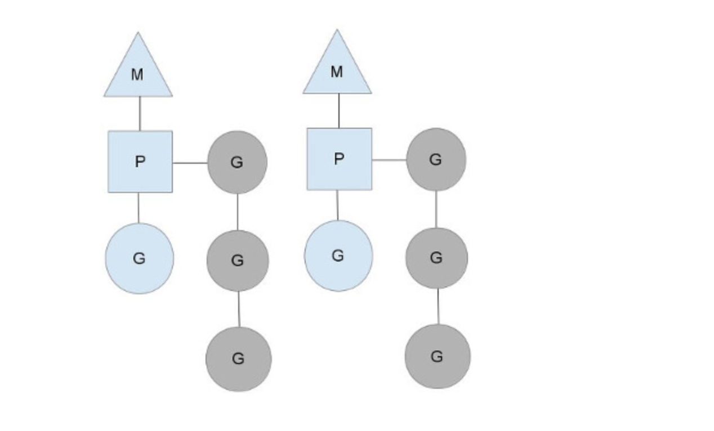
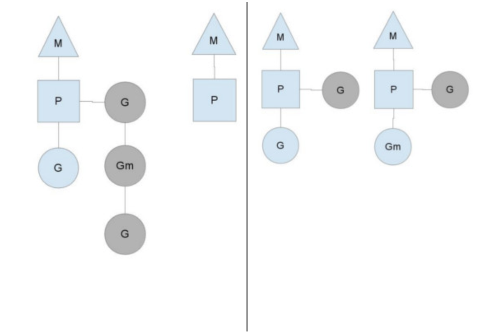

# Планировщик

## Определение

Планировщик - "маленькая ОС" внутри каждой программы, которая управляет работой горутин

## GOMAXPROCS

Планировщик среды выполнения Go использует параметр GOMAXPROCS, чтобы определить, сколько потоков ОС необходимо использовать для одновременного выполнения кода Go. Значение по умолчанию - это количество ядер ЦП на машине

## MPG

M - тред ОС "Machine"

P - процессор = GOMAXPROCS

G - горутина

P включает себя runque (очередь неиспользованных горутин), которую он должен выполнять

https://morsmachine.dk/go-scheduler

## Виды многозадачности

Вытесняющая - все программы равны. Выделяет каждой строго одинаковое количество времени. Обеспечивая справедливость и равенство.

Кооперативная - выполняются столько, сколько им нужно, и сами уступают место друг-другу. Так обеспечивается гармония и эффективность.

## Многозадачность Go

Неявная кооперативность:

- горутина уступает место другим при обращении к вводу-выводу, каналам, вызовам ОС ...

- может уступить место при вызове любой функции

- runtime.Gosched (переключение планировщик на другую горутину)

## Основные принципы планировщика Go

- внутри него FIFO (порядок запуска горутин обуславливается порядком их вызова)

- создает кол-во тредов небольше чем кол-во ядер

- захват чужой работы: в процессе заканчиваются горутины для планирования. Он берет и вытаскивает горутины из глобальной очерееди (примерно половины очереди). Это гарантирует, что в работе будут все процессы.

- не прерывает работу горутин

## Ограничения планировщика Go

- нет контроля приоритетов Go

- нет гарантий выполнения времени выполнения горутин
