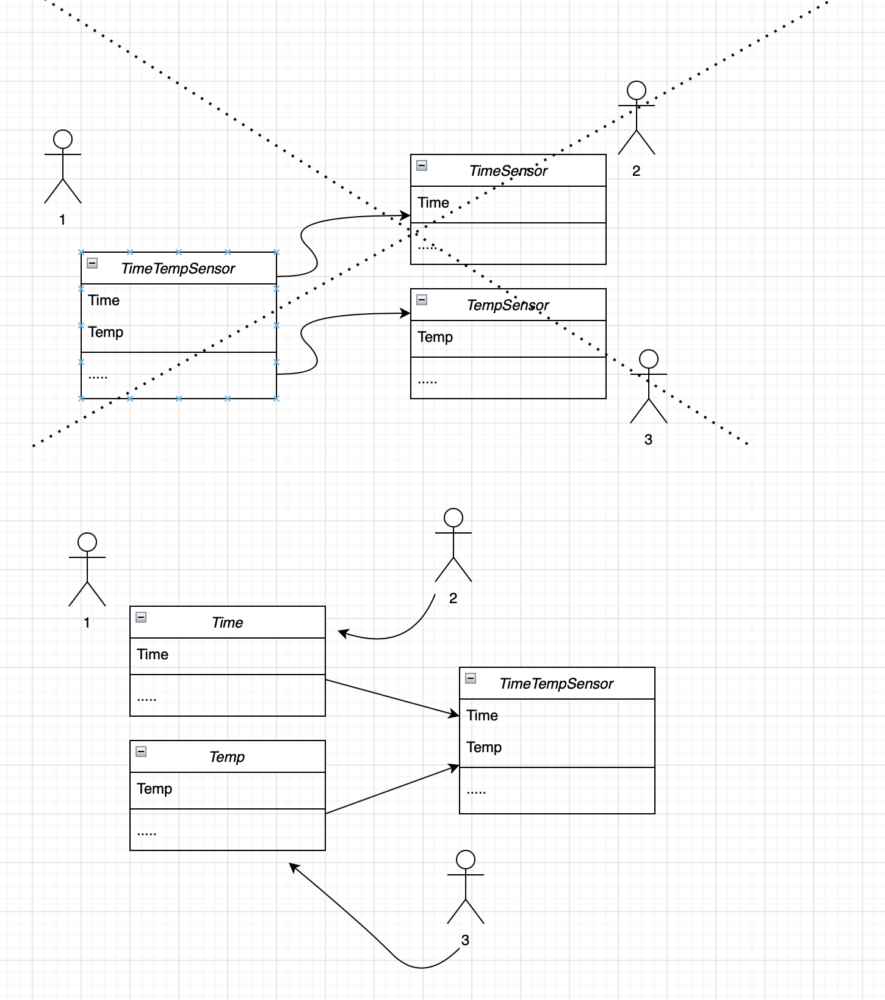
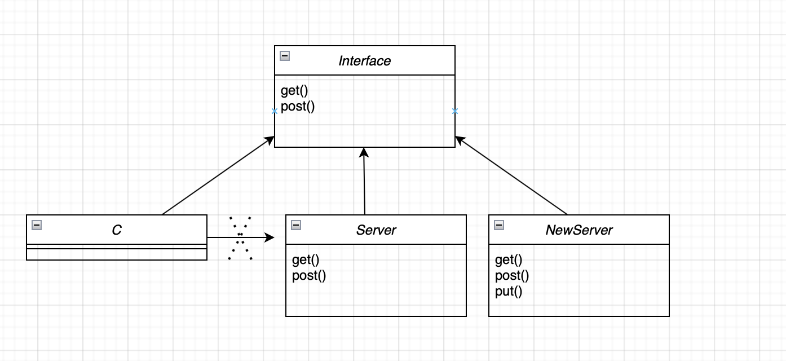
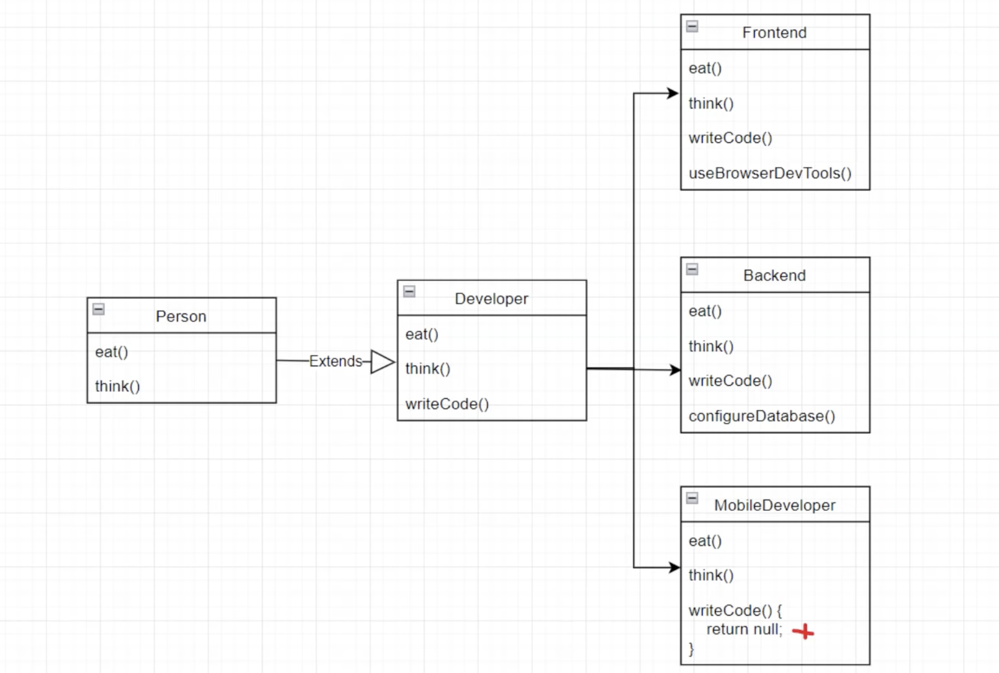
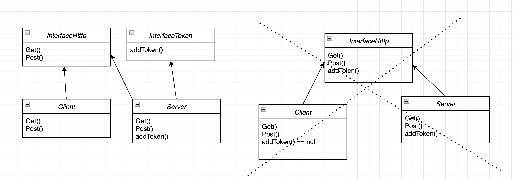
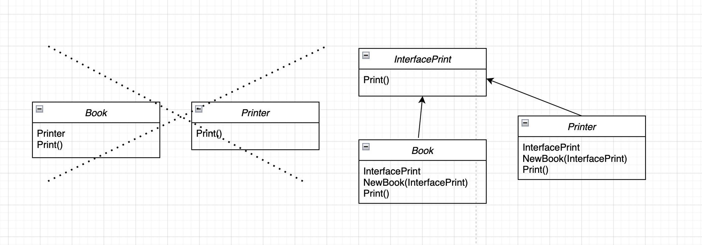

# SOLID

## Опредление

SOLID - это 5 основных приципов ООП

## S - single responsobility principle

S - для каждого класса должно быть определенно одно назначение.

Через класс должна проходить одна ось изменений, класс должен меняться только по одной причине.

- декомпозиция

- класс инкапсулирует решение одной задачи

## O - open closed principle

O - класс должен быть открыт для расширений, но закрыт для изменений.

- меньше вероятности ошибки

## L - liskov substitution principle

L - поведение наследующих классов не должно противоречить поведение классов родителей. Наследуем класс должен дополнять, а не замещать родительский класс.

## I - interface segregation principle

I - программные сущности не должны зависеть от методов, которые они не используют. При проектирование интерфейсов, нужно продумавать, чтобы он подходил для определенного класса.

- избавляем программные сущности от методов, которые они не используют

- код становится менее связанным

## D - dependency inversion principle

D - элементы высшего и низшего уровня должны зависеть от абстракций. Ничего в коде не должно зависить от конкретной имплементации.

Модули верхнего уровня не должны зависеть от модулей нижнего уровня. И те и другие должны зависеть от абстракций.

Абстракции не должны зависеть от деталей. Детали должны зависеть от абстракций.

